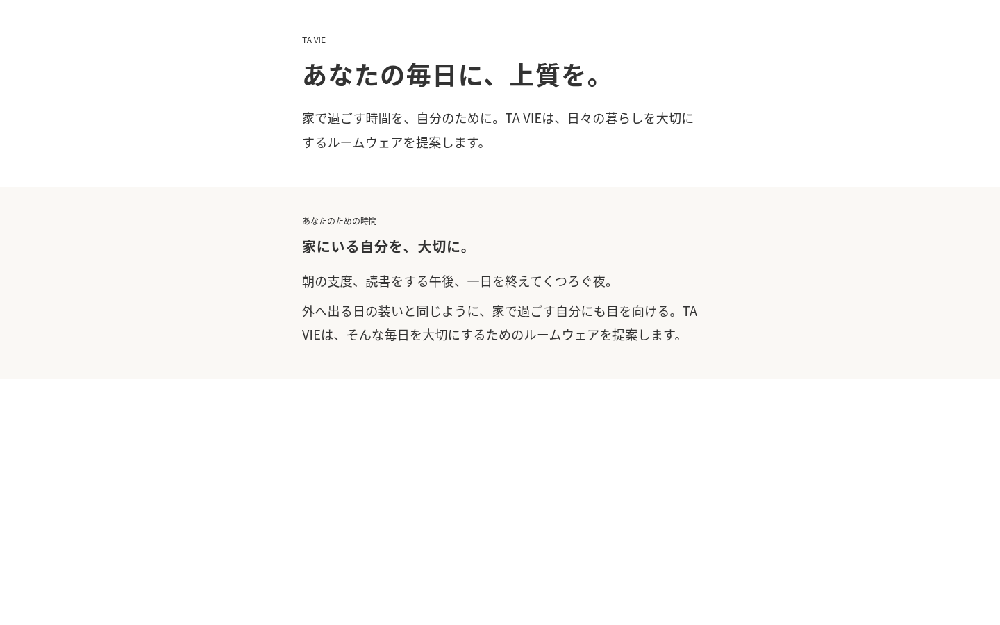
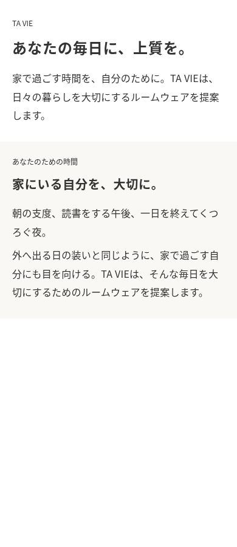

# TA VIE｜修正テーマの受け取り

Broadcast 8.1.1 のトップページ文言・配色・余白を修正した納品ファイルです。

- [修正済みテーマ ZIP](delivery/TA-VIE-Broadcast-8.1.1-edited.zip)
- [変更一覧・Shopify 編集画面の操作・手動反映用原稿](delivery/README-TA-VIE.md)
- [検証結果](delivery/validation.md)
- [変更前後の設定値・差分](delivery/changes.json)

テーマ ZIP のリンクを開き、ファイル画面の **Download raw file（ダウンロード）** を選んでください。リポジトリの **Code → Download ZIP** は説明書を含む別の ZIP なので、Shopify 用には上記のテーマ ZIP を使います。

正式商品・商品写真・ブログが未確認のため、その欄は非表示で準備しています。既存ロゴと購入処理は保持しました。本番への反映・公開は実施していません。アップロード前に、反映手順に沿って最新テーマとの設定差分を確認してください。

## 本文のローカル表示

以下は実際の Rich text Liquid とテーマ CSS を使った本文の表示確認です。Shopify の画像・CDN フォント・ヘッダー・フッター・ストアデータには接続していません。

PC：

スマートフォン：

